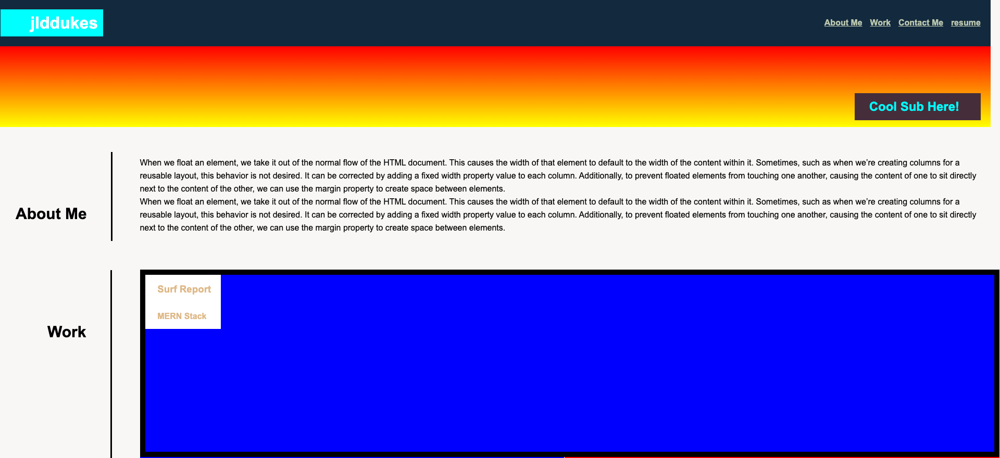
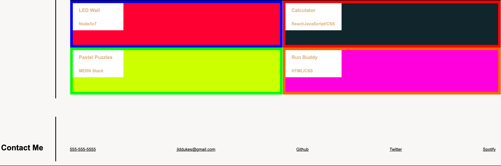

# BOOTCAMP-CHALLENGE2-PROJECT-DOS
This repository was created to help with guiding me in making my technical coding portfolio.

## Description
This portfolio was created by me to showcase my skills with HTML and CSS properties. I spent a lot of time working to perfect and mimic the baseline example. For reference to future employeers, you can contact me through the links on the page. When viewing this design, think about each color and have amazing thoughts. 

## Installation
N/A

## Usage
To use this portfolio, use the above and below navigation links for contact and viewing of my social media. Please use proper edicate when viewing links to my personal information. 

## Credits

## Liscense

